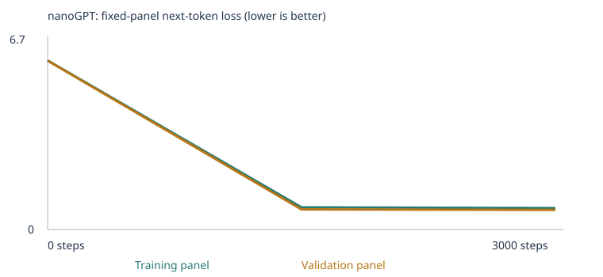

# Class 4: Building a Custom LLM

MBA 290T, Fundamentals of Agentic AI, Berkeley Haas. Fall 2026.
Author: Sebastián Bardacosta.

I trained Karpathy's nanoGPT from scratch on my laptop, twice. The first run uses the
classroom corpus that the notebook generates. The second run adds three small text
files I wrote to teach opposites, grammar and negation. Both runs were tested on the
same 48 fixed language evals before and after training. After the two required
experiments I ran nineteen more, one variable at a time, and logged each with a hypothesis
written before the run, the metric, the result and a one-line conclusion in
[EXPERIMENTS.md](EXPERIMENTS.md). The trained model answers
prompts in a terminal chat. It is a tiny language model. It continues sentences. It
does not answer questions.

This repository is my copy of the course template
[pepealonso95/custom-llm](https://github.com/pepealonso95/custom-llm). The template
files `evals/`, `run_evals.py`, `chat.py` and `nanogpt_model.py` are unchanged and
checksum-pinned by the notebook.

## Contents

| What | Where |
|---|---|
| Executed notebook, Experiment 1 (starter corpus) | [custom_llm_experiment1_starter.ipynb](custom_llm_experiment1_starter.ipynb) |
| Executed notebook, Experiment 2 (extended corpus) | [custom_llm_experiment2_extended.ipynb](custom_llm_experiment2_extended.ipynb) |
| Notebook source (settings, prediction) | [custom_llm.ipynb](custom_llm.ipynb), built from [custom_llm.py](custom_llm.py) |
| Results, Experiment 1 | [runs/experiment1_starter/](runs/experiment1_starter/), [ZIP](runs/experiment1_starter.zip) |
| Results, Experiment 2 | [runs/experiment2_extended/](runs/experiment2_extended/), [ZIP](runs/experiment2_extended.zip) |
| My added teaching text, Experiment 2 | [corpus_added/](corpus_added/) (copy the three .txt files into `corpus/` to rerun) |
| Extra: Experiment 3 (4x more corpus) | [custom_llm_experiment3_more_corpus.ipynb](custom_llm_experiment3_more_corpus.ipynb), [runs/experiment3_more_corpus/](runs/experiment3_more_corpus/), [ZIP](runs/experiment3_more_corpus.zip), [corpus_added/experiment3/](corpus_added/experiment3/) |
| Extra: Experiments 4 to 15, log with hypotheses | [EXPERIMENTS.md](EXPERIMENTS.md); notebooks [E4](custom_llm_experiment4_new_categories.ipynb), [E5](custom_llm_experiment5_all_seven.ipynb), [E6](custom_llm_experiment6_coverage.ipynb), [E7](custom_llm_experiment7_6000steps.ipynb), [E8a](custom_llm_experiment8_seed7.ipynb), [E8b](custom_llm_experiment8_seed2026.ipynb), [E9](custom_llm_experiment9_alice_raw.ipynb), [E10](custom_llm_experiment10_alice_slice.ipynb), [E11](custom_llm_experiment11_no_warnings.ipynb), [E12](custom_llm_experiment12_mcguffey_pdf.ipynb), [E13](custom_llm_experiment13_aesop.ipynb), [E14](custom_llm_experiment14_generated_5k.ipynb), [E15](custom_llm_experiment15_folder_only.ipynb), [E16a](custom_llm_experiment16_e14_seed7.ipynb), [E16b](custom_llm_experiment16_e14_seed2026.ipynb), [E17](custom_llm_experiment17_e14_6000steps.ipynb), [E18a](custom_llm_experiment18_lr_0003.ipynb), [E18b](custom_llm_experiment18_lr_00003.ipynb), [E19](custom_llm_experiment19_generated_10k.ipynb), [E20](custom_llm_experiment20_batch64.ipynb); runs under [runs/](runs/); generators in [corpus_added/experiment4/](corpus_added/experiment4/) and [corpus_added/experiment6/](corpus_added/experiment6/); book text in [corpus_added/experiment9/](corpus_added/experiment9/) and [corpus_added/experiment10/](corpus_added/experiment10/) |
| Fixed eval suite and runner | [evals/language_evals.json](evals/language_evals.json), [run_evals.py](run_evals.py) |
| Chat interface and evidence | [chat.py](chat.py), [evidence/](evidence/) |
| Leakage guardrail | [check_corpus.py](check_corpus.py) |
| Held-out test (E21): 14 new prompts, scored on saved models | [heldout_evals/heldout_evals.json](heldout_evals/heldout_evals.json), results in [evidence/heldout/](evidence/heldout/) |

## How to run

I ran everything locally on an Apple M4 MacBook, macOS 26.6, CPU only.

```bash
python3.12 -m venv .venv
source .venv/bin/activate
pip install -r requirements.txt
jupyter nbconvert --to notebook --execute custom_llm.ipynb --output executed.ipynb
```

Each run takes about 12 seconds on this machine and creates a folder and a ZIP under
`llm_runs/`. The settings are the first code cell of the notebook. Before every
training run I ran `python check_corpus.py` (see the leakage section at the end).

## My three choices

| Choice | Experiment 1 | Experiment 2 | Why |
|---|---|---|---|
| Corpus | classroom, `corpus/` empty | classroom plus 3 files I wrote | The assignment asks for the starter first, then an extension for at least two eval categories |
| Training steps | 3,000 | 3,000 | The template's reference run reached its plateau by step 1,500 and did not improve by 3,000. I kept 3,000 to be past the knee and to compare with the reference |
| Learning rate | 0.001 | 0.001 | Standard AdamW start. The notebook ramps it up over 100 steps and then decays it on a cosine. The reference run did not diverge with it. Later I measured ×3 and ÷3 on my best corpus (E18): ×3 was harmless, ÷3 under-trained |

I kept seed 42, the same eval panels, the same sampling seeds and the same eval suite
across both experiments. Only the corpus changed.

### Corpus numbers

| | Experiment 1 | Experiment 2 |
|---|---|---|
| Generated classroom passages | 6,200 | 6,200 |
| Reserved passages removed (contain an eval prefix) | 160 | 160 |
| Passages from my files | 0 | 181 |
| Unique passages after deduplication | 4,592 | 4,773 |
| Train / validation split (90/10 by passage) | 4,132 / 460 | 4,295 / 478 |
| Vocabulary (509 max + UNK, BOS, EOS) | 136 | 424 |
| Word types omitted from vocabulary | 0 | 0 |
| Unknown-token rate, training | 0.0% | 0.0% |
| Unknown-token rate, held-out | 0.0% | 0.50% |

Sources: Experiment 1 [corpus_manifest.json](runs/experiment1_starter/corpus_manifest.json),
[vocabulary_report.json](runs/experiment1_starter/vocabulary_report.json).
Experiment 2 [corpus_manifest.json](runs/experiment2_extended/corpus_manifest.json),
[vocabulary_report.json](runs/experiment2_extended/vocabulary_report.json).

The classroom corpus is synthetic. Section 3 of the notebook generates sentences from
8 templates and 8 domains. My three files are plain UTF-8 text that I wrote for this
assignment, so there are no permission issues. In the two required experiments there
are no PDFs, so there were no extraction warnings; the manifest shows 0 warnings for
each file. The external texts, used only in the extra experiments, are public-domain
Project Gutenberg books: Alice's Adventures in Wonderland (ebook 11, E9 and E10),
McGuffey's First Reader (ebook 14640, E12) and Aesop's Fables (ebook 21, E13). Raw and
cleaned files are under [corpus_added/](corpus_added/).

**PDF extraction check (E12).** I printed the cleaned primer to a 13-page PDF and
compared pypdf's extraction with the text before training: 6,519 tokens, identical
token stream, 0 empty pages. A first attempt had wrapped long lines in the middle of
words ("contemporar y"), which the extraction faithfully reproduced; wrapping at word
boundaries fixed it. The run's [corpus_manifest.json](runs/experiment12_mcguffey_pdf/corpus_manifest.json)
records 13 pages, 740 unique passages and 0 warnings.

## Prediction and what happened

**Written before Experiment 1 ran** (the full text is in the notebook's prediction cell):
validation loss between 0.5 and 1.5, not near zero, because some template slots are
genuinely random; train and validation curves close together; samples that look like
template sentences; the 16 starter cases going from chance to most of 16; the 8 transfer
cases to about half; the 24 extension cases staying at exactly 0 because their words are
not in the vocabulary; and the neighbors of "customer" becoming client, buyer, shopper,
consumer and subscriber.

**Observed:** validation loss 0.706. Train 0.678. Starter 16/16. Transfer 4/8.
Extension 0/24 with 0 scorable. Neighbors of "customer" by cosine similarity: shopper
0.978, client 0.977, buyer 0.977, subscriber 0.971, consumer 0.970, then a gap to
"team" at 0.503. Every point held. That says more about how controlled the corpus is
than about my forecasting. One thing I did not predict: between step 1,500 and 3,000
the validation loss only moved from 0.718 to 0.706. Half the budget bought almost nothing.

**Written before Experiment 2 ran:** vocabulary to roughly 300; the 9 cases in my three
categories become scorable and maybe 4 to 6 of 9 pass; other extension categories stay
at 0; starter stays near 16/16; validation loss slightly above 0.71.

**Observed:** vocabulary 424, more than I guessed. Only 3 of the 9 targeted cases became
scorable, not 9, and 1 of those 3 passed. Starter stayed 16/16. Transfer went to 8/8,
which I did not predict. Validation loss 0.703, slightly lower, not higher. The
comparison section explains each of these.

## Run facts

| | Experiment 1 | Experiment 2 |
|---|---|---|
| Completed steps | 3,000 of 3,000 | 3,000 of 3,000 |
| Training time | 7.39 s | 8.34 s |
| Interrupted | no | no |
| Parameters | 111,872 | 130,304 |
| Hardware | Apple M4, macOS 26.6, CPU, PyTorch 2.14.0, Python 3.12.14 | same |

The parameter count grows with the vocabulary because the embedding table is
vocabulary size times 64 and it is tied to the output layer.
Sources: [training_summary.json](runs/experiment1_starter/training_summary.json),
[config.json](runs/experiment1_starter/config.json),
[training_summary.json](runs/experiment2_extended/training_summary.json),
[config.json](runs/experiment2_extended/config.json).

## Loss curves and the full loss table

These are fixed panels of 20 training documents and 20 validation documents. They are
not full-corpus losses. Loss is the mean over non-padding next-token targets. Lower is
better.

Experiment 1:


| Step | Training panel (20 docs) | Validation panel (20 docs) |
|---|---|---|
| 0 | 4.9263 | 4.9275 |
| 1500 | 0.6821 | 0.7182 |
| 3000 | 0.6783 | 0.7061 |

Experiment 2:



| Step | Training panel (20 docs) | Validation panel (20 docs) |
|---|---|---|
| 0 | 6.0512 | 6.0416 |
| 1500 | 0.7919 | 0.7202 |
| 3000 | 0.7670 | 0.7033 |

The step 0 values are ln(136) = 4.91 and ln(424) = 6.05. That is the loss of guessing
uniformly over the vocabulary. The untrained model is a uniform guesser.

In Experiment 2 the training panel ends higher than in Experiment 1 (0.767 vs 0.678)
while the validation panel is the same (0.703 vs 0.706). The training panel is a random
sample of 20 training docs and probably contains some of my new sentences, which are
less repetitive than the templates and harder to predict. The two experiments have
different vocabularies, so the losses are not directly comparable anyway.

Files: [history.json](runs/experiment1_starter/history.json),
[training.csv](runs/experiment1_starter/training.csv),
[history.json](runs/experiment2_extended/history.json),
[training.csv](runs/experiment2_extended/training.csv).

## Samples: untrained, halfway, final

Same generation settings each time: temperature 0.8, seed 2026, 4 samples, 32 tokens max.

Experiment 1, step 0 ([file](runs/experiment1_starter/samples/step_0000.txt)):

```
pear professor bond doctor course harvest team physician journey checking buyer delivery traffic report the lecturer item offering and system <UNK> taste recommended mentioned bus question customer at mortgage nurse in instructor
kitchen purchase journey product question discussion journey service . nurse local
compared and purchase update mortgage question loan taste in market treatment learned another item bicycle product bicycle focused data and dentist recommended mango apple taxi bicycle delivery peach quality update student lesson
important hospital juice patient return recommended deposit tutor returned understand kitchen student design ordered hospital treatment important package traffic with yesterday investment important of mentioned store ordered mortgage nurse shopper the station
```

Experiment 1, step 1500 ([file](runs/experiment1_starter/samples/step_1500.txt)):

```
our school has a question about the new educator and lesson .
a review of risk helped us understand the different deposit .
we learned about the important website during a discussion of data .
our school has a question about the different instructor and course .
```

Experiment 1, step 3000 ([file](runs/experiment1_starter/samples/step_3000.txt)):

```
our school has a question about the new educator and lesson .
a review of risk helped us understand the different deposit .
the report about the nurse explains the health in detail .
the consumer compared the offering after checking the price .
```

Experiment 2 samples: [step 0](runs/experiment2_extended/samples/step_0000.txt),
[step 1500](runs/experiment2_extended/samples/step_1500.txt),
[step 3000](runs/experiment2_extended/samples/step_3000.txt).

What changed: at step 0 the output is a random word salad, because every word has the
same probability. By step 1500 every sample is a complete template sentence with the
right domain words in the right slots. Between 1500 and 3000 the sentences do not get
better. They are already as good as the templates allow. What did not change: none of
the 12 samples in Experiment 2 use my added sentences. My 181 passages are 4% of the
training data, so at temperature 0.8 the sampler almost always picks a template start.

## Tokens, IDs, vectors, gradient, update

All numbers here are from Experiment 1:
[tokenization.json](runs/experiment1_starter/tokenization.json) and
[inspection.json](runs/experiment1_starter/inspection.json).

### One sentence to IDs

The tokenizer lowercases the text and splits it into words and punctuation marks.
Each distinct word gets a row number in an alphabetically sorted list. The example
sentence in tokenization.json is:

```
today the school focused on lesson and the local professor .
[1, 121, 118, 101, 42, 74, 61, 7, 118, 63, 88, 3, 2]
```

1 is BOS (start of passage), 2 is EOS (end), 118 is "the" both times, 3 is ".".
The ID is a pin number, not a value. Row 118 is not closer in meaning to row 117 than
to row 3. The model is trained to predict ID 118 after ID 121, then 101 after 118, and
so on: input `[1, 121, 118, ...]`, target `[121, 118, 101, ...]`.

### One word to its 64-number vector

My probe word is "customer", ID 28. Row 28 of the embedding table holds 64 numbers.
Before training (random initialization):

```
[-0.0576, -0.0048, 0.0426, 0.0193, 0.0156, -0.0288, 0.0256, 0.0001, 0.0247, 0.0207, 0.0074, -0.0331, -0.0535, -0.0057, -0.0242, -0.0147, 0.0047, -0.0105, -0.0084, -0.0183, -0.0201, 0.0051, -0.0109, -0.0126, 0.0284, -0.0026, -0.0041, 0.0136, -0.0099, -0.0167, 0.0019, -0.0015, 0.0160, -0.0057, -0.0007, -0.0013, -0.0073, -0.0009, 0.0015, -0.0050, -0.0290, 0.0181, -0.0073, -0.0054, 0.0156, -0.0045, 0.0416, 0.0524, 0.0226, -0.0154, -0.0251, -0.0068, 0.0294, -0.0025, 0.0298, -0.0228, -0.0302, 0.0064, 0.0505, 0.0075, -0.0107, 0.0247, -0.0145, 0.0132]
```

After 3,000 steps:

```
[0.0366, -0.0182, 0.1330, 0.1059, 0.0630, 0.0189, 0.1523, 0.0929, -0.0632, -0.0173, 0.0341, -0.0474, -0.0646, -0.0866, -0.1450, -0.0359, -0.1569, -0.1503, -0.0076, -0.0707, -0.0930, 0.0091, -0.0648, 0.0175, 0.0039, -0.0625, 0.1125, -0.0643, 0.0520, -0.1567, -0.0706, 0.0617, -0.0318, 0.1414, 0.0913, 0.0565, 0.0196, -0.1348, 0.1223, -0.0338, 0.1187, 0.0046, -0.1344, 0.0529, -0.0376, -0.1031, 0.0203, 0.0381, -0.0198, -0.1507, 0.0303, -0.1206, 0.0166, 0.0778, 0.1181, 0.0557, 0.0934, 0.0026, 0.0371, 0.0756, 0.1185, 0.0144, 0.0913, -0.0746]
```

The vector's length grew from 0.17 to 0.67 and its direction changed completely. No
single coordinate means anything on its own. What matters is where the vector points
relative to other rows. After training, "customer" points within about 12 degrees of
shopper, client, buyer, subscriber and consumer (cosine 0.97 to 0.98). Before training
its nearest rows were bus, educator and helped at cosine 0.20, which is noise. The
corpus put those six words in identical sentence slots, and the gradient pushed rows
that predict the same next words toward the same direction. Nobody told the model they
are synonyms.

### The first gradient and the first update

At step 0, coordinate 0 of the "customer" row was −0.057592. The gradient of the loss
with respect to that number was +0.000693. Positive means "increasing this number would
increase the loss", so the optimizer moved it down. After the first update it was
−0.057602. The change is −0.0000100.

A plain gradient step would be learning rate times gradient. At step 0 the learning
rate is 0.00001, not 0.001, because of the 100-step warmup. So that would be
−0.00001 × 0.000693 = −0.000000007, which is 1,400 times smaller than the actual
change. AdamW divides each weight's step by a running estimate of its gradient size.
On the first step that estimate equals the gradient itself, so every weight moves by
almost exactly the learning rate in the direction of its gradient sign. The saved
change of −0.0000100 matches the learning rate of 0.00001. Source:
`first_update` in [inspection.json](runs/experiment1_starter/inspection.json).

### One next-token probability comparison

Prefix: "the customer". Probability of the next word, from `probabilities_before`
and `probabilities_after` in inspection.json:

| Next word | Before training | After training |
|---|---|---|
| reviewed | 0.0071 | 0.1782 |
| recommended | 0.0064 | 0.1712 |
| ordered | 0.0062 | 0.1685 |
| the | 0.0083 | 0.0009 |
| customer | 0.0160 | 0.0001 |

Before training every word sits near 1/136 = 0.0074. After training, the six verbs of
the template "the customer VERB the product after checking the price" take about 17%
each. The model learned the shape of the corpus.

### In my own words

A **token** is one unit of text, here a whole word or a punctuation mark. Its ID is a
row number in a sorted list. The number carries no meaning, it is only an address.

An **embedding** is the 64 numbers stored at that address. They start random and the
training moves them. Words that are used in the same places end up pointing the same
way, because the same gradient pushes them. That is why "customer" ended next to
"shopper": the corpus never distinguished them.

A **gradient** is the slope of the loss with respect to one weight. For coordinate 0 of
"customer" it was +0.000693: if I raised that number a little, the loss would go up a
little. The sign tells the direction to move, the size tells how sensitive the loss is.

A **weight update** is the small change the optimizer makes after each batch. Here it
was −0.0000100. It was not learning rate times gradient because AdamW normalizes by the
gradient's size, so early steps move every weight by about the learning rate. Over
3,000 steps the sum of these small moves turned a uniform guesser into a model that
puts 17% on "reviewed" after "the customer".

## Attention, sampling, temperature

**Attention.** For the prefix "the customer" the notebook saves head 1 of block 1. The
rows are BOS, "the", "customer"; each row says how much that position reads from the
earlier ones:

```
[1.000, 0.000, 0.000]
[0.606, 0.394, 0.000]
[0.485, 0.423, 0.092]
```

Zeros above the diagonal are the causal mask: no position can read a later one. When
the model predicts the word after "customer" it mixes 48% of the BOS position, 42% of
"the" and 9% of itself. This is how earlier context reaches the prediction.

**From probabilities to words.** The last layer outputs one score per vocabulary word.
Softmax turns the scores into probabilities that sum to 1. The sampler draws one word
from that distribution, appends it, and repeats until EOS or the token limit.

**Temperature** divides the scores before softmax. It changes the sampling, not the
weights. From [temperature_comparison.json](runs/experiment1_starter/temperature_comparison.json)
(same seed each time):

| Temperature | Sample 4 |
|---|---|
| 0.3 | the local consumer was mentioned in the purchase report yesterday . |
| 0.8 | the consumer compared the offering after checking the price . |
| 1.2 | the consumer compared the offering after checking the price . |

At 0.3 the distribution is sharpened and the model picks its favorite words. At 1.2
it is flattened. On this corpus the effect is small because the model is very sure at
most positions. In Experiment 2, temperature 1.2 produced one broken sentence,
"the read was full we credit the risk report yesterday .", which the other two
temperatures did not. See [temperature_comparison.json](runs/experiment2_extended/temperature_comparison.json).

**What stayed fixed, what changed.** Fixed in both experiments: the model shape
(2 blocks, 4 heads, 64 dimensions, 48-token context), seed 42, batch size 32, the
90/10 split rule, the 20-document panels, the sampling seeds and the 48 evals. Changed
during training: all weights, including the embedding table and the position table.
Changed only at inference: temperature and the sampling seed. Nothing at inference
touches the weights. Sources: [config.json](runs/experiment1_starter/config.json),
[config.json](runs/experiment2_extended/config.json).

## The 48 language evals

Suite: [evals/language_evals.json](evals/language_evals.json), unchanged from the
template, SHA-256 `e8affcd7...` as pinned in the notebook. Runner:
[run_evals.py](run_evals.py), unchanged.

**Scoring.** Only the prompt enters the model. The runner reads the probability of each
of the 4 candidate words for the next token. The highest wins. 1 point if it is the key,
0 if not or if tied. If any prompt word or any of the 4 choices is not in the
vocabulary, the case is "out_of_vocabulary": it scores 0 in the all-case rate and is
excluded from scorable accuracy. A free continuation at temperature 0.8 is also saved
but never scored. 16 cases test starter patterns, 8 test the same words in new
sentence shapes, 24 test eight skills the starter corpus does not contain.

### Four result sets

| Experiment | Stage | Correct / 48 | Scorable | All-case success | Scorable accuracy | Coverage | Starter (16) | Transfer (8) | Extension (24) | Files |
|---|---|---|---|---|---|---|---|---|---|---|
| 1 starter | untrained | 9 | 24 | 18.8% | 37.5% | 50.0% | 6 | 3 | 0 (0 scorable) | [folder](runs/experiment1_starter/language_evals/untrained/) |
| 1 starter | trained | 20 | 24 | 41.7% | 83.3% | 50.0% | 16 | 4 | 0 (0 scorable) | [folder](runs/experiment1_starter/language_evals/final/) |
| 2 extended | untrained | 6 | 27 | 12.5% | 22.2% | 56.3% | 5 | 1 | 0 (3 scorable) | [folder](runs/experiment2_extended/language_evals/untrained/) |
| 2 extended | trained | 25 | 27 | 52.1% | 92.6% | 56.3% | 16 | 8 | 1 (3 scorable) | [folder](runs/experiment2_extended/language_evals/final/) |

Each folder has eval_cases.json, eval_results.json, eval_results.csv and
eval_summary.json. Comparison files:
[Experiment 1](runs/experiment1_starter/language_eval_comparison.json),
[Experiment 2](runs/experiment2_extended/language_eval_comparison.json).

The untrained scores (9 and 6) are chance on 4-choice questions. They differ between
experiments because the vocabulary size changed, so the random initial network is a
different network even with the same seed.

### By category, trained models

| Category | Cases | Exp 1 correct / scorable | Exp 2 correct / scorable |
|---|---|---|---|
| domain_context (starter) | 8 | 8 / 8 | 8 / 8 |
| domain_place (starter) | 8 | 8 / 8 | 8 / 8 |
| new_wording (transfer) | 8 | 4 / 8 | 8 / 8 |
| grammar | 3 | 0 / 0 | 0 / 0 |
| opposites | 3 | 0 / 0 | 1 / 3 |
| negation | 3 | 0 / 0 | 0 / 0 |
| reference | 3 | 0 / 0 | 0 / 0 |
| sequence | 3 | 0 / 0 | 0 / 0 |
| spatial_relations | 3 | 0 / 0 | 0 / 0 |
| everyday_knowledge | 3 | 0 / 0 | 0 / 0 |
| categories_and_analogies | 3 | 0 / 0 | 0 / 0 |

### My extension categories and the added data

I chose **opposites, grammar and negation**. In Experiment 1 all 24 extension cases
were unscorable because the vocabulary had 136 words, all from 8 business domains.
Words like "opposite", "bird" or "walked" did not exist for the model. I chose these
three skills because each is a sentence pattern that can be taught with short
sentences, unlike everyday knowledge, which needs facts.

I wrote 181 sentences by hand, in [corpus_added/](corpus_added/):

- [opposites.txt](corpus_added/opposites.txt), 70 sentences. The frame "the opposite of
  A is B" with 20 pairs in both directions (big/small, fast/slow, tall/short, warm/cool
  and so on), plus contrast sentences that use temperature, amount and sound words in
  ordinary situations: "the soup was hot but the salad was cold".
- [grammar.txt](corpus_added/grammar.txt), 56 sentences. "one X is" with singular
  nouns, "the Xs are" with plurals, and "yesterday ... walked / cooked / played" for past
  tense, with different subjects.
- [negation.txt](corpus_added/negation.txt), 55 sentences. Corrections in the form
  "the cup is not green , it is white , so the cup is white" and "she did not buy rice ,
  she bought beans , so she bought beans" with many objects and people.

I wrote them from the category names and the do-not-use list printed by
`check_corpus.py`, not from the eval file. I used commas instead of periods inside a
correction because the notebook splits training text at every period, and a
two-sentence story would become two unrelated passages.

### What changed and why

**Vocabulary coverage.** The vocabulary went from 136 to 424. Scorable cases went from
24 to 27. Only the 3 opposites cases became scorable. The 3 grammar cases and the 3
negation cases stayed out_of_vocabulary, but not because of the prompts: every prompt
word was in the vocabulary. The missing words are in the **answer choices**. From
eval_results.json: grammar cases miss the distractors "am", "were", "walk" and
"walking"; negation cases miss "box", "bread", "missing" and the name "ava". I never
wrote sentences with "am" or "were". I removed "box" from my negation sentences because
the guardrail flagged "the box is not" as 4 consecutive tokens of an eval prompt. And
"ava" is on the do-not-use list, so that case can never be scored under my own rule.
This is a coverage failure caused by the choices, not by the prompts. I only noticed it
after the run.

**Learned pattern, opposites.** 1 of 3 correct. The model got "noisy" to "quiet"
right. For "hot" it chose "fast" (0.015) over "cold" (0.006). For "empty" it chose
"quiet" (0.007) over "full" (0.001). The model learned the frame: after "the opposite
of X is" it predicts an adjective from my opposite list. It did not learn the pair
binding for hot/cold or empty/full, because those pairs only appeared in contrast
sentences, never inside the "opposite of" frame. The one correct answer is weak
evidence: "quiet" was also its top choice for the "empty" case. The free continuations
for all three prompts were "school ." or "patient .", template words with no relation
to the prompt. The multiple-choice score and the free text tell different stories.

**Learned pattern or noise, transfer.** The 8 transfer cases went from 4/8 to 8/8, with
the exact same 8 prompts and the same vocabulary for those words. The four that flipped
are lang_18, lang_19, lang_22 and lang_23. Nothing I added mentions those domains. The
honest explanation is that the network in Experiment 2 is a different random
initialization, because the embedding table has a different size, and this run happened
to land in a better spot for those four borderline cases. I cannot attribute this to my
data. One run per condition is not enough to separate the effect of the data from the
effect of the initialization. That is a limitation of this whole comparison.

**Both.** Overall all-case success went from 41.7% to 52.1%. About one third of that
comes from the one opposites case that became scorable and correct (coverage plus a
weak pattern), and two thirds from the transfer cases (pattern or luck).

**Embeddings of the new words.** In Experiment 2 the nearest neighbors of "hot" are
noisy 0.78, cold 0.70, empty 0.62, quiet 0.60. The nearest neighbors of "big" are fast,
strong, small, warm. The contrast sentences pulled hot, cold, noisy, quiet, empty and
full into one cluster of "adjectives that appear in contrast sentences", not into
pairs. This matches the eval result: the model knows these words belong together but
not which one is the opposite of which.

**One concrete failure.** Negation. In the chat, I gave the model my own teaching
pattern with a new object: "the car is not red , it is blue , so the car is". It
answered "red". That is exactly the sentence pattern in negation.txt, and it still
picked the negated word. With 55 examples seen about 20 times each, the model learned
that a color follows "the car is", not that the color after "not" is excluded. The
negation eval cases could not even be scored. Negation was a failure on both measures.

These are public development tests that guided my corpus choices. They are not an
unseen benchmark and they say nothing about general language ability. The only
held-out evidence in this repository is the 14-prompt test of E21, described in the
extras above.

### Extra: Experiment 3, four times more corpus

After the two required experiments I ran a third one with the same settings, seed and
evals, to answer the question Experiment 2 left open: how much of the failure was
missing vocabulary and how much was the model. The advice from the professor was to give
the model more corpus. I generated 715 teaching sentences from short word lists with
[make_corpus.py](corpus_added/experiment3/make_corpus.py). The files are in
[corpus_added/experiment3/](corpus_added/experiment3/): 264 opposites, 248 grammar and
203 negation sentences, about four times Experiment 2. They include the answer-choice
words that were missing before (am, were, walk, walking, bread, missing, box) in
ordinary sentences, and never the do-not-use names or prompt sequences.
`check_corpus.py` reported 0 problems and 96 warnings of the same kind as before.
My prediction, written in the notebook before the run: 5 more scorable cases, grammar
passes, negation still fails, vocabulary about 480.

| | Experiment 3 |
|---|---|
| Passages from my files / unique passages | 745 / 5,337 |
| Train / validation | 4,803 / 534 |
| Vocabulary | 478 (0 omitted types) |
| Unknown-token rate, training / held-out | 0.0% / 0.14% |
| Parameters, training time | 133,760, 8.75 s |
| Loss, step 0 / 1500 / 3000, training panel | 6.2040 / 0.7384 / 0.7247 |
| Loss, step 0 / 1500 / 3000, validation panel | 6.2025 / 0.7279 / 0.7327 |

Sources: [config.json](runs/experiment3_more_corpus/config.json),
[history.json](runs/experiment3_more_corpus/history.json),
[corpus_manifest.json](runs/experiment3_more_corpus/corpus_manifest.json),
[vocabulary_report.json](runs/experiment3_more_corpus/vocabulary_report.json),
[training_curves.svg](runs/experiment3_more_corpus/training_curves.svg),
[eval_separation.json](runs/experiment3_more_corpus/eval_separation.json) (160 excluded, same as before).

| Experiment | Stage | Correct / 48 | Scorable | All-case success | Scorable accuracy | Coverage | Starter (16) | Transfer (8) | Extension (24) | Files |
|---|---|---|---|---|---|---|---|---|---|---|
| 3 more corpus | untrained | 7 | 31 | 14.6% | 22.6% | 64.6% | 4 | 1 | 2 (7 scorable) | [folder](runs/experiment3_more_corpus/language_evals/untrained/) |
| 3 more corpus | trained | 25 | 31 | 52.1% | 80.6% | 64.6% | 16 | 7 | 2 (7 scorable) | [folder](runs/experiment3_more_corpus/language_evals/final/) |

The nine targeted cases after training, with the probability of each choice:

| Case | Category | Status | Expected | Predicted | Probabilities |
|---|---|---|---|---|---|
| lang_25 | grammar | scored | is | is | is 0.9925, are 0.0004, were 0.0000, am 0.0000 |
| lang_26 | grammar | scored | are | is | is 0.7251, are 0.2291, was 0.0131, am 0.0014 |
| lang_27 | grammar | out_of_vocabulary | walked | | choice "walks" not in vocabulary |
| lang_28 | opposites | scored | cold | warm | warm 0.0238, heavy 0.0199, fast 0.0065, cold 0.0007 |
| lang_29 | opposites | scored | full | early | early 0.0073, soft 0.0067, quiet 0.0040, full 0.0011 |
| lang_30 | opposites | scored | quiet | late | late 0.0139, round 0.0112, loud 0.0054, quiet 0.0019 |
| lang_31 | negation | scored | blue | green | green 0.0553, red 0.0378, blue 0.0329, yellow 0.0077 |
| lang_32 | negation | out_of_vocabulary | milk | | prompt word "ava" not in vocabulary |
| lang_33 | negation | scored | closed | closed | closed 0.1158, open 0.0339, wide 0.0016, missing 0.0003 |

What this run shows:

- **Coverage.** Scorable cases went from 27 to 31, four more, not five. The past-tense
  case has the distractor "walks", which I never wrote. I wrote "walk" and "walking".
  The case with the eval name stays unscorable by my own rule.
- **Grammar, learned pattern, incomplete.** Singular agreement passed with 0.99. Plural
  agreement failed: 0.73 for "is" against 0.23 for "are". I never wrote the exact prefix
  of that case because it is on the do-not-use list, but I wrote "two dogs are", "our
  dogs are", "both dogs are" and 18 other plural nouns with "the ... are". The model did
  not carry plural agreement to that one prefix. It learned the frequent frame, not the
  rule.
- **Negation, learned pattern for one case.** The gate/shop/window sentences taught
  "not open ... closed" well enough: closed 0.116 against open 0.034. The color case
  failed, and the way it failed is informative: the top choice was "green", which is
  not in the prompt at all. Green is the first color in my generator's list, so it is
  the most frequent word after "the OBJECT is" in the negation file. Frequency beat
  context.
- **Opposites went from 1/3 to 0/3.** With four times more data the model still picks a
  frame adjective (warm, early, late) instead of the pair. The single correct answer in
  Experiment 2 was luck, as I suspected there. My guardrail blocks any sentence that
  contains "opposite" together with an eval pair, so the pair binding can only come from
  contrast sentences, and this model does not extract it from co-occurrence.
- **Transfer dropped to 7/8** with nothing changed for those words. This supports the
  initialization-noise explanation given above for the 4/8 to 8/8 jump.
- **Overall.** Correct stayed at 25/48 and all-case success at 52.1%. Scorable accuracy
  fell from 92.6% to 80.6% because four harder cases entered the denominator. Validation
  loss ended at 0.733, above 0.703, because the text is more varied. Samples at
  temperature 0.8 are still all classroom templates
  ([step 3000](runs/experiment3_more_corpus/samples/step_3000.txt)); at temperature 1.2
  one sample reads "the tutor is on the roof .", a classroom noun inside my grammar
  frame, the first visible trace of the added data in free generation
  ([temperature_comparison.json](runs/experiment3_more_corpus/temperature_comparison.json)).

Conclusion: more corpus fixed coverage and taught two clean patterns. It did not fix
opposites or the plural case, and it did not raise the total. The chat evidence below is
from the Experiment 2 model; the Experiment 3 model is in
[runs/experiment3_more_corpus/model.pt](runs/experiment3_more_corpus/model.pt).

### Extra: Experiments 4 to 21 in one table

Counts and a ranking of all 21 experiments by quality of evidence are at the top of
[EXPERIMENTS.md](EXPERIMENTS.md#summary).

Full log with hypothesis, test, result and conclusion per experiment:
[EXPERIMENTS.md](EXPERIMENTS.md). Each hypothesis is also in the notebook's prediction
cell, written before that run. The guardrail ran before every run with 0 problems.

| Exp | Change | Vocab | Scorable | Correct | Val loss |
|---|---|---:|---:|---:|---:|
| E4 | 4 new categories only: sequence, spatial, knowledge, categories | 418 | 29 | 26 | 0.708 |
| E5 | E3 + E4 files together, 647 types against the 509 cap | 512 | 32 | 29 | 1.258 |
| E6 | E5 + coverage sentences, every missing eval word ≥ 8 times | 512 | 43 | 30 | 0.888 |
| E7 | E6 corpus, 6,000 steps | 512 | 43 | 34 | 0.822 |
| E8a | E6 corpus, seed 7 | 512 | 43 | 35 | 1.233 |
| E8b | E6 corpus, seed 2026 | 512 | 43 | 30 | 0.901 |
| E9 | E6 corpus + a whole public-domain book (Alice in Wonderland, 2,534 word types) | 512 | 25 | 25 | 1.886 |
| E10 | E6 corpus + 90 sentences of that book with mostly known words | 512 | 42 | 30 | 0.758 |
| E11 | E6 corpus minus the 194 sentences the guardrail marks as warnings | 512 | 39 | 27 | 0.923 |
| E12 | E6 corpus + an 1879 children's primer delivered as a PDF (1,115 word types) | 512 | 33 | 27 | 1.303 |
| E13 | E6 corpus + Aesop's Fables, a second whole book (5,435 word types) | 512 | 27 | 27 | 1.960 |
| E14 | E6 corpus + 3,326 generated sentences with no new word types | 512 | 42 | 36 | 1.025 |
| E15 | my files only, folder mode, no classroom sentences | 512 | 20 | 8 | 2.006 |
| E16a | E14 corpus, seed 7 | 512 | 43 | 37 | 0.905 |
| E16b | E14 corpus, seed 2026 | 512 | 43 | 34 | 1.019 |
| E17 | E14 corpus, 6,000 steps | 512 | 42 | 35 | 0.950 |
| E18a | E14 corpus, learning rate 0.003 | 512 | 42 | 35 | 1.010 |
| E18b | E14 corpus, learning rate 0.0003 | 512 | 42 | 31 | 1.141 |
| E19 | E6 corpus + 5,934 generated sentences, twice E14 | 512 | 42 | 33 | 1.096 |
| E20 | E19 corpus, batch size 64 (meant for E14's corpus, see the log) | 512 | 42 | 32 | 1.081 |
| E21 | held-out test, no training: 14 new prompts on saved models | | 14 | 8, 8, 10 for the three E14 seeds | |

Nine things I learned from these that I could not see in E1 to E3:

- **Coverage is a frequency problem.** A word written twice can land entirely in the 10%
  validation split and never enter the vocabulary (E4, "desk"). With 647 word types the
  509 cap silently removes the rarest words, which are exactly the one-off eval words
  (E5). Using each needed word at least 8 times in ordinary sentences fixed both (E6:
  43 of 48 cases scorable; the 4 that remain need the eval names, which my rules forbid,
  or one word I forgot, "salmon").
- **The noise floor is about 5 cases.** Same corpus, same steps, three seeds: 30, 35 and
  30 correct (E6, E8a, E8b). So the E7 gain from 6,000 steps (+4) and most differences
  between experiments are inside the noise. Only four extension cases pass under all
  three seeds: the three grammar cases and one sequence case. Those are the patterns
  this model actually learned. Opposites, negation, spatial and knowledge cases flip
  with the seed.
- **Frames teach frequent wrong words too.** In E6 the trained model got 6 of the 19
  scorable extension cases; the untrained model got 8 by chance. On the color-negation
  case the top choice was "green", a word not in the prompt, because it was the most
  frequent color in my file. On the knowledge cases all four choices sat at probability
  0.000: the model had the words but no usable pattern.
- **"Give it more corpus" does not mean a book.** E9 added Alice's Adventures in
  Wonderland (Project Gutenberg, public domain, header and footer removed). Only 46% of
  its tokens were already in my vocabulary. The 509-word cap then kept the book's common
  words and cut 2,471 types, including the eval words: scorable cases fell from 43 to 25,
  the unknown-token rate went to 8.2%, and the samples filled with UNK. E10 added only
  the 90 sentences of the book whose words were mostly known: nothing broke (42 scorable,
  30 correct, 1.4% unknown), and nothing improved. With this tokenizer, more corpus only
  helps as more sentences over the same words, and that helps coverage, not reasoning.
- **The score does not depend on sentences that come close to the exam.** E11 removed
  the 194 sentences my guardrail flags as warnings (an answer word near a word of its
  own prompt). Correct went from 30 to 27, inside the 5-case seed noise, and 4 cases
  became unscorable only because their words lived mostly in those sentences.
- **The only "more corpus" that helped was more sentences over the same words.** E14
  generated 3,326 sentences from frames and word lists, every word already in the
  vocabulary, and reached 36 of 48, the best run, with 0.4% unknown tokens. A children's
  primer as a PDF (E12) and a second whole book (E13) both cost coverage, like Alice.
  E16 repeated E14 with seeds 7 and 2026: 37 and 34. Three seeds of the E14 corpus give
  36, 37, 34 (mean 35.7) against 30, 35, 30 for E6 (mean 31.7), which is the criterion I
  wrote before the run, so this gain is the one result in the extras that survives the
  seed test. Eight extension cases pass under all three seeds, against four for E6.
- **Ordinary text contains exam prompts by accident.** Aesop's Fables has "The Dogs and
  the Fox" and "one bird", which are exact two-word eval prompts. The guardrail blocked
  that run; the notebook's own check would have rejected the file too. I removed the 7
  sentences and reran. This is the case the leakage checks exist for.
- **Steps and learning rate, measured on the best corpus.** Doubling steps to 6,000
  (E17) lowered the validation loss to 0.95 but gave 35 correct, inside the seed range.
  Learning rate 0.003 (E18a) stayed finite thanks to gradient clipping and scored the
  same. Learning rate 0.0003 (E18b) ended with the training loss still falling, 31
  correct, and lost a starter case for the first time: too small a step means the
  budget runs out before the floor. Doubling the generated sentences (E19) gave 33: the
  gain in E14 came from covering the frames, not from their count.
- **The patterns transfer to sentences the model never saw.** The 48 public cases guided
  my corpus choices, so they cannot support a generalization claim. E21 is a separate
  set of 14 prompts I wrote after all corpus decisions, checked to be absent from every
  training text, scored with the unchanged runner and no training. The three E14-corpus
  models get 8, 8 and 10 of 14 (chance is 3.5); E6 gets 6; the E1 model cannot score any
  because it lacks the words; the untrained model gets 2. The same frames that fail in
  the public suite fail here too: opposite pairs, sequence, and one plural prefix.

### Rerun the evals on my saved model

```bash
python run_evals.py --model runs/experiment2_extended/model.pt --output results/rerun
```

I did this after the notebook run. The output is in
[evidence/rerun_evals_experiment2/](evidence/rerun_evals_experiment2/). The model hash
in its eval_summary.json is `d35c0ccc...`, the same as in the notebook's result, and
the scores are identical: 25/48, 27 scorable. The untrained weights are in
`model_untrained.pt` in each run folder and can be rerun with `--stage untrained`.

## Chat interface

Code: [chat.py](chat.py), unchanged from the template. It loads model.pt and its saved
vocabulary and generates 24 tokens max at temperature 0.8. Each prompt starts fresh,
there is no conversation memory. Unknown words and truncation past 48 tokens are
printed. The model is not retrained by chatting.

Launch:

```bash
source .venv/bin/activate
python chat.py --model runs/experiment2_extended/model.pt --transcript evidence/my_chat.json
```

Type `/quit` to exit. Model used: Experiment 2, run `20260921T221653_354968Z`, 3,000
steps, SHA-256 `d35c0cccf55edb046a64b39017ae0af649284181eaab21d76638481744609eb3`.

Evidence: [chat_screenshot.png](evidence/chat_screenshot.png) (my terminal session,
cropped to remove the shell prompt with my username), [my_chat.json](evidence/my_chat.json)
(the transcript that session saved), and an earlier scripted session with the same four
prompts: [chat_transcript.json](evidence/chat_transcript.json),
[chat_session.log](evidence/chat_session.log). The replies are identical because the
sampling seed is fixed per turn.

| Prompt | Reply | Comment |
|---|---|---|
| the team discussed the mortgage and the | interest at the bank . | Template pattern. Correct domain and place. |
| the opposite of tall is | play . | Wrong. "play" is from my grammar file. The frame was learned, the pair was not. |
| the car is not red , it is blue , so the car is | red . | Wrong. The negation failure described above. |
| what is the capital of france ? | , at was , so at the kitchen . | Unknown words: ?, capital, france, what. The model has no idea and produces fragments. |

The chat limitation: this is a tiny language model trained on 4,773 short sentences.
It continues sentences in the shapes it saw. It does not answer questions, and it
cannot use a word it never saw.

## How eval material stayed out of training

**What the guardrail did and did not do.** `check_corpus.py` is a check I run on
corpus/ after writing and before training. It is stricter than the notebook's own
exact-prefix check. In this project it did not limit training or the corpus in any way:

| Fact | Number |
|---|---|
| Training runs | 23 (plus a 10-step smoke test) |
| Runs blocked by the guardrail | 1: the first attempt of E13, because Aesop's Fables contains the exact eval prompts "the dogs" and "one bird"; the notebook's own check would have rejected that file as well |
| Sentences it flagged in drafts before a first run | 14 reworded (E2, E4, E6), 7 removed from Aesop (E13), 66 generator frames fixed (E14) |
| Corpus size it reduced | 7 sentences of 2,078 in one book; every other file passed whole, including Alice (E9) |
| What actually limits the corpus | the notebook's 509-word vocabulary cap, measured in E5, E9, E12 and E13 |

The audit of every run's actual training text (below) covers all 23 runs.
The 4 cases that stay unscorable in every experiment need the eval names (3 reference
cases and one negation case). The eval guide itself asks for reference stories "with
different names", so that limit comes from the assignment, not from my script. If the
guardrail were switched off, nothing in these results would change except that the
audit files below would not exist. I kept it on because it produces the evidence that
the exam stayed out, at zero cost to the experiments.

- The notebook removes every generated classroom sentence that contains one of the 16
  reserved eval prefixes before the split and before building the vocabulary. Both runs
  record 160 excluded passages for cases lang_01 to lang_16 in
  [eval_separation.json](runs/experiment1_starter/eval_separation.json) and
  [eval_separation.json](runs/experiment2_extended/eval_separation.json).
- The notebook rejects imported files that contain an exact eval prompt, and refuses a
  corpus folder that includes evals/ or the project root. `CORPUS_FOLDER` stayed
  `corpus`.
- Before every training run I ran [check_corpus.py](check_corpus.py). It verifies the
  suite checksum, then scans every file in corpus/ for exact prompts, any 4 consecutive
  prompt tokens, any passage that shares 3 or more content words with one eval case, any
  eval name, and any copy of the template's example corpus. It exits 1 on any hit. It
  also prints a do-not-use list, which is what I wrote my sentences from.
- My first draft of the three files had 4 problems: "the box is not", "the door is not"
  and "yesterday she" matched eval token sequences. I changed them to "the crate",
  "the fence" and "yesterday my aunt". After that the script reported 0 problems and 34
  warnings. Every warning was of one kind: an answer word appears in the same sentence
  as one of its prompt's content words, for example "the soup was hot but the salad was
  cold". I reviewed each one. They are different sentence shapes and situations from the
  tests, and the eval guide explicitly suggests teaching opposites through contextual
  contrasts, so I kept them.
- After the runs I audited the **actual training text** of each run, the corpus.txt
  saved in the run folder, with [audit_training_text.py](audit_training_text.py). It
  searches every eval prompt as a normalized token sequence and as a plain substring,
  the seven eval names, and any 4-token sequence shared with a prompt, separating the
  classroom generator's own sentence frames from anything my files added. Results for
  all 23 runs are in [evidence/](evidence/), one file per run, for example
  [Experiment 1](evidence/leakage_audit_experiment1_starter.txt),
  [Experiment 2](evidence/leakage_audit_experiment2_extended.txt) and
  [Experiment 14](evidence/leakage_audit_experiment14_generated_5k.txt). All 23: 0 exact
  prompt hits, 0 names, 0 four-token sequences from added files, including the runs
  with whole books. The 24 starter and
  transfer prompts do share 4-token frames such as "the report about the" with the
  classroom corpus, in every run including Experiment 1 with corpus/ empty, because the
  professor's tests are built from the same templates and the notebook reserves the
  exact prefixes.
- The template's own checks, `python -m unittest test_language_evals test_corpus`,
  pass: 14 tests, OK.
- Eval outputs, chat transcripts and this README were never placed in corpus/.
- The corpus_manifest.json of Experiment 2 lists exactly three files with their
  SHA-256 hashes, and the vocabulary_report.json shows 421 word types, all from the
  classroom sentences and those three files.
- For Experiments 4 to 8 the teaching files are generated by the scripts in
  corpus_added/experiment4 and corpus_added/experiment6 from short word lists. Words
  from the eval answer lists (for example "am", "were", "desk", "north") appear in
  ordinary sentences so that cases become scorable. The eval guide allows the underlying
  words and facts to overlap and forbids the test items themselves; the guardrail
  enforces the second part and reported 0 problems before every run. I say this plainly
  because it is a choice a reader should be able to judge.

## One limitation and one next experiment

**Limitation.** The comparison between the two required experiments has one run per
condition. The vocabulary change forces a different random initialization, so the 4/8
to 8/8 change in the transfer group cannot be separated from initialization luck. E8
later measured that luck: same corpus, three seeds, a spread of 5 cases.

**Next experiment.** Three seeds per condition before claiming any gain, and a small
held-out set of new prompts that never guided my corpus choices, to test generalization
instead of this public development benchmark. E7 also suggests the varied corpus was
under-trained at 3,000 steps (validation loss kept falling to 6,000), which is the
opposite of the starter corpus, where the loss was flat after 1,500.

## Embedding viewer

[embedding-viewer.html](embedding-viewer.html) is the template's offline viewer. Open
it in a browser, click "Open your checkpoint", and load
[checkpoint.json](runs/experiment2_extended/checkpoint.json) from either run folder to
see the initial and final 64-dimensional vectors projected to 3D. PCA keeps a fraction
of the variance, so 3D distances are approximate. The cosine neighbors above use all 64
coordinates.

## License

MIT, see [LICENSE](LICENSE). nanoGPT is by Andrej Karpathy under
[its MIT license](NANOGPT_LICENSE).
